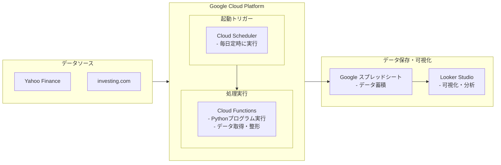

# FinanceTracker-document

## 1. 概要

### 1.1. システム名
投資指標自動収集システム

### 1.2. システムの目的
従来、手動で行っていた各種金融指標のデータ収集作業を完全に自動化する。収集・蓄積したデータを活用し、市場全体の動向把握を容易にすると共に、将来的な投資戦略の分析やバックテストの基盤を構築することを目的とする。

### 1.3. 背景
ユーザーはこれまで、複数の金融情報サイトから必要な指標（株価、為替、指数など）の終値を、毎日手作業でGoogleスプレッドシートに転記していた。この定型作業を自動化することで、作業負担をなくし、より付加価値の高い分析作業に時間を充てられるようにする。

---

## 2. システム構成

本システムは、Google Cloud Platform (GCP) 上に構築されたプログラムが、各種データソースから指標を取得し、指定されたGoogleスプレッドシートに記録する構成をとる。

### 2.1. アーキテクチャ図

### 2.2. 使用技術・ツール
| 要素 | 使用技術/ツール | 役割 |
| :--- | :--- | :--- |
| **データ収集** | Python | プログラミング言語 |
| | yfinance (ライブラリ) | Yahoo Financeからデータを取得 |
| | investpy (ライブラリ) | investing.comからデータを取得 |
| **実行環境** | Google Cloud Functions | Pythonプログラムの実行環境 (サーバーレス) |
| **自動実行** | Google Cloud Scheduler | 毎日定時にプログラムを起動 |
| **データ保存** | Google Sheets API | プログラムからスプレッドシートへの書き込み |
| | Google スプレッドシート | 収集データの保存・蓄積先 |
| **可視化** | Looker Studio | 蓄積データのグラフ化・ダッシュボード化 |

---

## 3. 機能要件

### 3.1. データ収集機能
- **実行頻度**: 1日1回、毎日定時に自動実行する。
- **取得データ**: 各指標の「終値 (Close)」。
- **収集対象指標一覧**:
| No. | 列名 (日本語) | 収集対象指標 | データソース | シンボル/取得キー |
|:---:|:---|:---|:---|:---|
| 1 | 日付 | - | プログラムで生成 | - |
| 2 | 曜日 | - | プログラムで生成 | - |
| 3 | 米ドル | 米ドル/円 為替レート | Yahoo Finance | `JPY=X` |
| 4 | ユーロ | ユーロ/円 為替レート | Yahoo Finance | `EURJPY=X` |
| 5 | 豪ドル | 豪ドル/円 為替レート | Yahoo Finance | `AUDJPY=X` |
| 6 | 日経平均 | 日経平均株価 | Yahoo Finance | `^N225` |
| 7 | TOPIX | 東証株価指数 (TOPIX) | Yahoo Finance | `^TOPX` |
| 8 | NYダウ | NYダウ工業株30種平均 | Yahoo Finance | `^DJI` |
| 9 | JGB10Y | 日本国債10年物利回り | investing.com | `Japan 10Y` |
| 10 | REIT | 東証REIT指数 | Yahoo Finance | `^TREIT` |
| 11 | 八十二 | 八十二銀行 株価 | Yahoo Finance | `8359.T` |
| 12 | 原油 | WTI原油先物価格 | Yahoo Finance | `CL=F` |
| 13| S&P500 | S&P 500 | Yahoo Finance | `^GSPC` |

### 3.2. データ保存機能
- **保存先**: ユーザー指定のGoogleスプレッドシート。
- **保存形式**: ユーザー提供のスクリーンショットに基づく、以下の13列のフォーマットを維持する。
  `[A:日付] [B:曜日] [C:米ドル] [D:ユーロ] [E:豪ドル] [F:日経平均] [G:TOPIX] [H:NYダウ] [I:JGB10Y] [J:REIT] [K:八十二] [L:原油] [M:S&P500]`
- **書き込み方式**: 既存データの最終行を検出し、その次の行に新しい1日分のデータを追記する。

### 3.3. データ可視化・分析機能
- **使用ツール**: Looker Studio
- **要件**:
    - 蓄積されたスプレッドシートのデータをデータソースとする。
    - 各指標の時系列推移をグラフで可視化できること。
    - ユーザーがダッシュボード上で表示期間を自由に指定して分析できること。

---

## 4. 非機能要件

- **運用**: 完全に自動化し、ユーザーが自身のPCを起動するなどの手動操作を一切必要としないこと。
- **可用性**: Google Cloud Platformのインフラに準拠する。
- **コスト**: Google Cloud Platformおよび各APIの無料利用枠の範囲内での運用を目指す。

---
**以上**
